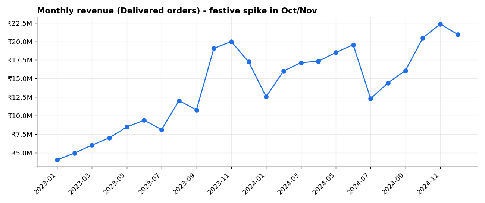
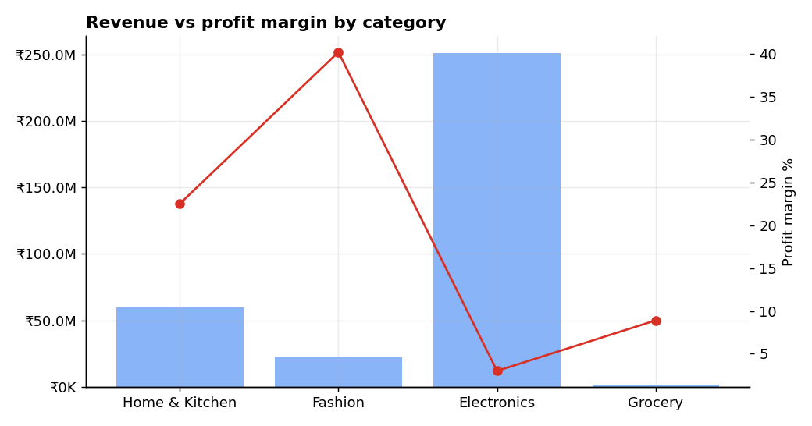
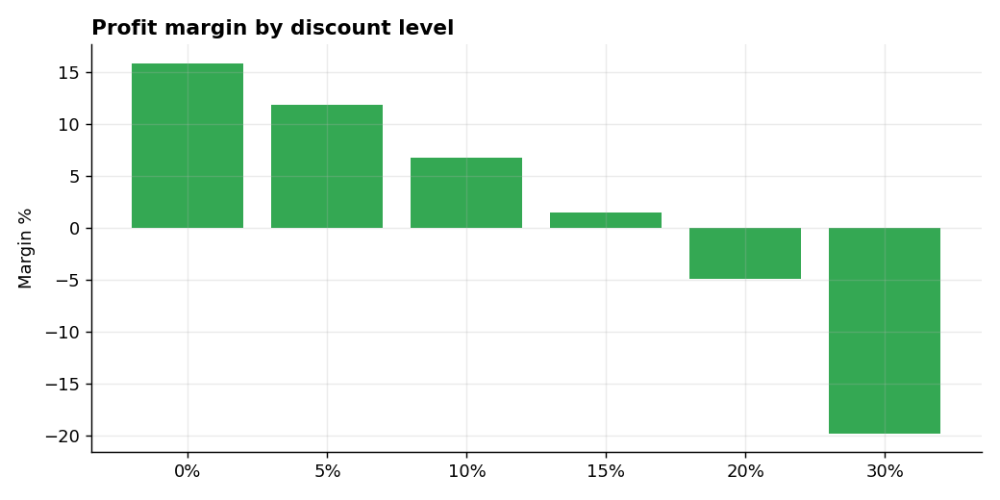

# Project 1: E-commerce Sales & Customer Analytics (India)

**Tools:** SQL (SQLite) · Python (pandas, matplotlib) · Excel (Tables, SUMIFS, PivotTable) · Power BI (DAX)

## Business problem
An Indian online retailer sells across Electronics, Fashion, Home & Kitchen and Grocery. Leadership wants to know:
1. Which categories and regions actually make money, not just revenue?
2. Are discounts helping or hurting profit?
3. Which customers matter most, and who is at risk of leaving?

## Dataset
Synthetic but realistic: **1,500 customers, 96 products, 12,000 orders (about 20,000 order lines), Jan 2023 to Dec 2024**.
It is generated by `python/generate_data.py` with a fixed random seed, so results are reproducible.
Dirty data is injected on purpose (60 duplicate orders, missing ship modes, inconsistent text case, stray spaces in city names)
so the cleaning step is genuine. The findings below describe this synthetic data and demonstrate the method.
The same pipeline works on a real dataset (e.g. Kaggle Superstore or Olist) with small column-name changes.

## Approach
1. **Load and clean in SQL** (`sql/01_cleaning.sql`): de-duplicate orders, standardise text, handle missing values, build one `sales_fact` table.
2. **Analyse in SQL** (`sql/02_analysis_queries.sql`): CTEs, window functions (`LAG`, `RANK`, `NTILE`, running totals), cohort retention, RFM segmentation, Pareto analysis.
3. **Automate in Python** (`python/analysis.py`): runs the whole pipeline, produces charts, exports tables for BI.
4. **Summarise in Excel** (`excel/Ecommerce_Sales_Summary.xlsx`): formula-driven summary plus a PivotTable build guide.
5. **Visualise in Power BI** (`powerbi/POWERBI_GUIDE.md`): data model, DAX measures and a two-page dashboard layout.

## Key findings
| # | Finding | Evidence |
|---|---|---|
| 1 | **Electronics is 75% of revenue but only a 3.0% margin**; Fashion is 6.7% of revenue at a 40.2% margin | `category_profitability.csv` |
| 2 | **Discounts of 20% and 30% make orders loss-making** (margins of -4.9% and -19.8%); undiscounted orders earn 15.9% | `discount_impact.csv` |
| 3 | Overall margin is **9.0%** on ₹33.5 crore revenue; 2024 revenue is about 63% higher than 2023 | `kpi_summary.csv`, Excel `Summary` sheet |
| 4 | **Champions are 389 customers (33%) but produce 69% of revenue**; "At Risk" customers hold another 14% | `rfm_segment_summary.csv` |
| 5 | The top 20% of customers drive about 59% of revenue and the top 40% about 82%, so it is concentrated but not a strict 80/20 | `pareto_customers.csv` |
| 6 | Revenue peaks in the festive quarter (Oct to Dec) in both years | `monthly_revenue_mom.csv` |
| 7 | South and West generate about 66% of revenue; East is the smallest region | `regional_performance.csv` |

## Recommendations (what I would tell the business)
- Cap discounts at 15% on Electronics, and stop 20%+ discounts unless clearance is the goal.
- Shift marketing spend toward high-margin Fashion and Home & Kitchen.
- Launch a win-back campaign for the 144 "At Risk" customers.
- Plan inventory and ad budget ahead of the Oct to Dec peak.

## How to run
```bash
pip install -r requirements.txt
python python/generate_data.py   # creates data/raw/*.csv
python python/analysis.py        # cleans, queries, charts, exports (needs Python 3.9+, SQLite 3.25+)
python python/build_excel.py     # builds the Excel workbook
```

## Folder structure
```
project-1-ecommerce-sales-analysis/
├── data/raw/            raw (dirty) CSVs
├── data/processed/      query outputs + Power BI inputs
├── sql/                 01_cleaning.sql, 02_analysis_queries.sql
├── python/              generate_data.py, analysis.py, build_excel.py
├── excel/               Ecommerce_Sales_Summary.xlsx
├── powerbi/             POWERBI_GUIDE.md  (add your .pbix here)
└── images/              charts (and your dashboard screenshots)
```

## Charts




## Skills demonstrated
Data cleaning · joins and CTEs · window functions · cohort and RFM analysis · KPI design · Excel formulas and pivots · DAX · data storytelling
