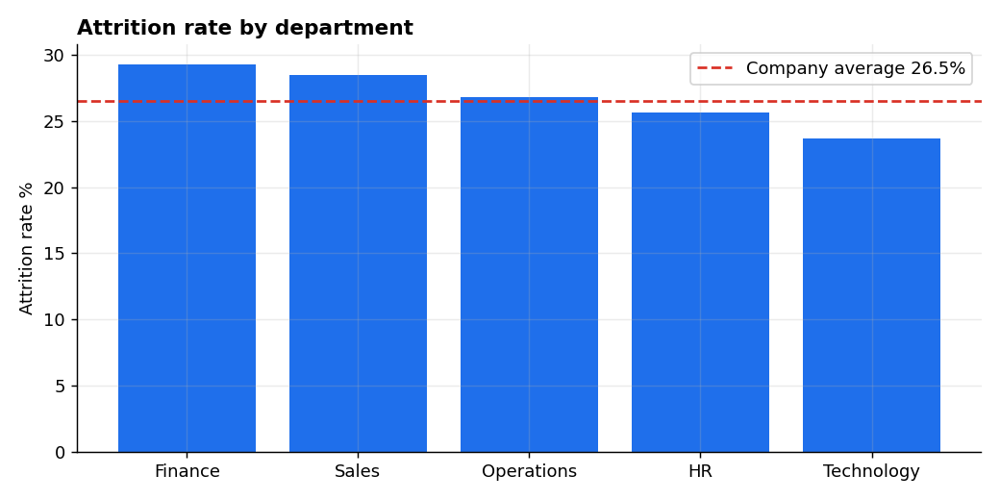
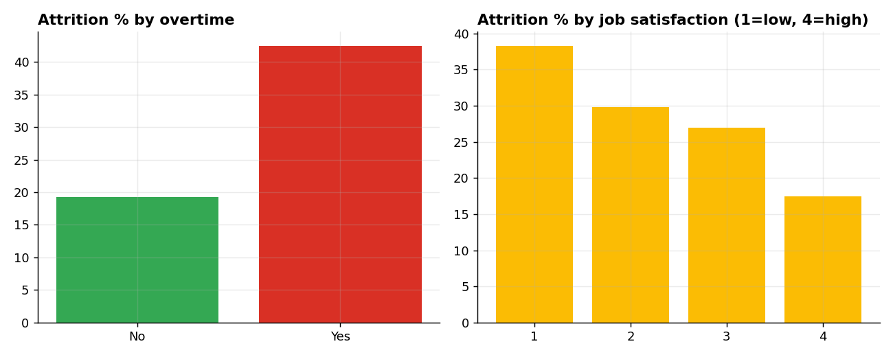
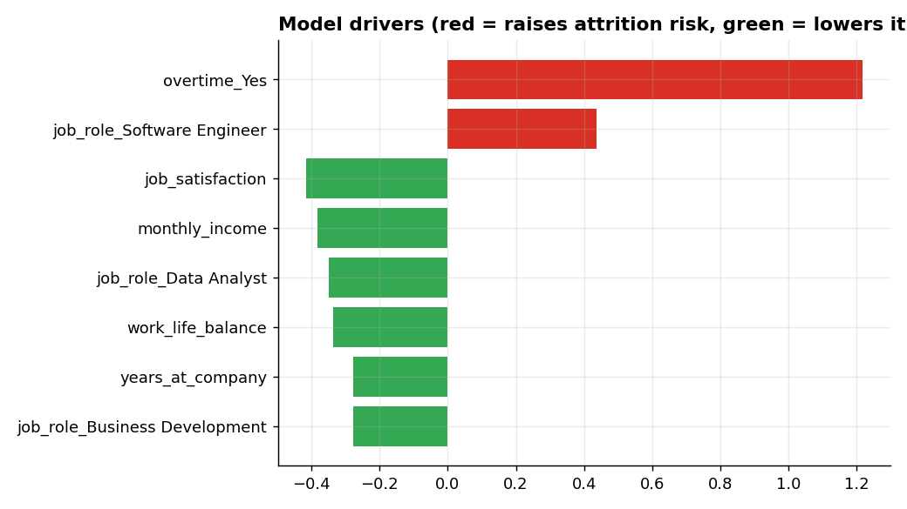

# Project 2: HR Attrition Analysis & Flight-Risk Model

**Tools:** Python (pandas, SciPy, scikit-learn) · R (glm, ggplot2) · SQL (SQLite) · Excel (COUNTIFS, PivotTable) · Power BI (DAX)

## Business problem
A 1,500-person company in India loses about one in four employees a year. HR wants to know:
1. **Who** is leaving, and which factors actually matter (not just which look suspicious)?
2. **What does it cost**, and where?
3. **Which current employees** are most at risk, so managers can act early?

## Dataset
Synthetic but realistic: **1,500 employees**, 15 attributes (department, role, income in INR, tenure, overtime, satisfaction, work-life balance, commute, etc.).
Attrition is generated from a logistic function of realistic drivers, and dirt is injected on purpose
(25 duplicate rows, 45 missing incomes, inconsistent case, `Y`/`N` vs `Yes`/`No`) so the cleaning step is genuine.
The findings describe this synthetic data and demonstrate the method. The pipeline also works on the public IBM HR Analytics dataset from Kaggle with small column changes.

## Approach
1. **Clean (pandas):** drop duplicates, standardise text and coding, impute missing income with the *job-role median*, assert data integrity.
2. **Explore (SQL):** attrition by department, overtime, tenure band, pay quartile (`NTILE` within department), satisfaction, replacement cost and a rule-based risk score.
3. **Test (SciPy):** chi-square and Mann-Whitney tests to separate real effects from noise.
4. **Model (scikit-learn, mirrored in R):** logistic regression for interpretable odds ratios, evaluated on a held-out 25% test set.
5. **Report (Excel and Power BI):** formula-driven summary, PivotTable guide, DAX measures and a dashboard layout.

## Key findings
| # | Finding | Evidence |
|---|---|---|
| 1 | Overall attrition is **26.5%** (397 of 1,500) | `attrition_overall.csv` |
| 2 | **Overtime is the strongest driver:** 42.5% attrition with overtime vs 19.3% without (about 2.2x); chi-square p < 0.001 | `attrition_by_overtime.csv`, `statistical_tests.csv` |
| 3 | **Low satisfaction hurts:** 38.3% attrition at satisfaction 1 vs 17.5% at satisfaction 4 | `attrition_by_satisfaction.csv` |
| 4 | **Pay matters:** the lowest pay quartile (within department) loses 33.7% vs 16.9% in the top quartile | `attrition_by_income_quartile.csv` |
| 5 | **Early tenure is the danger zone:** 33.8% attrition in years 0-2 vs about 20% afterwards | `attrition_by_tenure_band.csv` |
| 6 | **Department is NOT a significant driver** (range 23.7% to 29.3%, chi-square p = 0.45). Overtime and satisfaction explain more than department does | `statistical_tests.csv` |
| 7 | **Estimated cost of attrition is about ₹12.9 crore** (assumes replacement cost of 50% of annual salary; this is an editable rule of thumb, not a measured figure). Technology is the costliest department despite the lowest attrition rate, because salaries are higher | `attrition_cost_by_department.csv` |

### A trap I caught (worth mentioning in interviews)
Raw data shows employees with **5+ years since promotion leave less** (20.6% vs 27.6%), the opposite of the usual assumption.
The reason is confounding: that group has an average tenure of 8.3 years vs 3.1 years for everyone else, and long-tenure employees leave less.
Within the same tenure band, the promotion gap shows no meaningful effect. A simple group-by would have led to a wrong recommendation.

## Model results (be realistic about them)
- Logistic regression, test **ROC-AUC = 0.70**, recall for leavers 0.61, precision 0.40 (class-balanced).
- That is a *moderate* model. It is good enough to rank employees for a manager check-in list, not to make individual decisions.
- Largest effects (odds ratios, numeric features standardised): overtime 3.4x; job satisfaction 0.66 per standard deviation; income 0.68; work-life balance 0.72; tenure 0.76.
- Job-role coefficients are small and noisy, so I do not interpret them.
- Output: `data/processed/high_risk_employees.csv` (top 50 current employees by predicted risk).

## Recommendations
- Review overtime policy and workload first, since it is the biggest lever.
- Run 90-day check-ins and mentoring for new joiners (0-2 years).
- Audit pay for the bottom quartile of each department.
- Use satisfaction surveys as an early-warning signal.
- Use the risk list for supportive conversations, not for any punitive action.

## How to run
```bash
pip install -r requirements.txt
python python/generate_data.py    # creates data/raw/hr_employees.csv
python python/analysis.py         # clean, SQL, tests, model, charts, exports
python python/build_excel.py      # builds the Excel workbook
Rscript r/attrition_model.R       # optional: same modelling in R (needs dplyr, ggplot2)
```

## Folder structure
```
project-2-hr-attrition-analysis/
├── data/raw/            raw (dirty) CSV
├── data/processed/      cleaned data, query outputs, model outputs, Power BI inputs
├── sql/                 analysis_queries.sql
├── python/              generate_data.py, analysis.py, build_excel.py
├── r/                   attrition_model.R
├── excel/               HR_Attrition_Dashboard.xlsx
├── powerbi/             POWERBI_GUIDE.md  (add your .pbix here)
└── images/              charts (and your dashboard screenshots)
```

## Charts




## Skills demonstrated
Data cleaning · SQL window functions · hypothesis testing · logistic regression and odds ratios · confounding awareness · cost estimation with stated assumptions · Excel formulas and pivots · DAX · communicating model limits honestly
